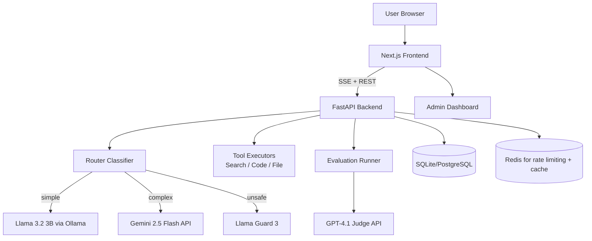

# Product Requirements Document
**Product:** Ollive - Intelligent AI Gateway  
**Version:** 1.0  
**Status:** Draft  
**Last Updated:** 2026-06-03

---

## 1. Executive Summary

**Vision**  
Ollive is an open-source, self-hostable AI gateway that intelligently routes user requests between local open-source models and frontier LLMs. It combines safety guardrails, persistent memory, tool use, and continuous evaluation into a single unified interface.

**Current State**  
A working prototype with dual-model chat (OSS + frontier), basic safety filtering, and a 200-prompt benchmark suite.

**Product Positioning**  
Ollive targets developers, AI researchers, and startups who want **full control over model choice, cost, and data privacy** without sacrificing assistant quality. Unlike closed platforms, Ollive runs locally or on your own infrastructure and provides transparent model routing, local moderation, and automated regression testing.

## 2. Problem Statement

| Pain Point | User Impact | Current Gap |
|------------|-------------|-------------|
| **Privacy & data leakage** | Users cannot share sensitive code/ideas with cloud APIs. | No self-hosted gateway that routes sensitive queries to local models only. |
| **High API costs** | Teams blow budgets on frontier models for trivial queries. | No intelligent routing that sends simple questions to cheap OSS models. |
| **Safety & compliance** | Harmful outputs or prompt injections create legal/reputational risk. | Keyword filters are brittle; no layered guardrail system. |
| **Evaluation overhead** | Manually comparing models across versions is tedious and unscalable. | No built-in benchmark suite with regression alerts. |
| **Context & memory loss** | Short chat windows break long conversations. | No persistent memory or summarization mechanism. |

## 3. Goals & Objectives

### Primary Goals (6 months - SMART)

| Goal | Success Criteria |
|------|------------------|
| **G1 - Intelligent routing** | Achieve >=90% routing accuracy (classify query as simple/complex/unsafe) on a held-out test set. |
| **G2 - Safety without cloud** | Local Llama Guard 3 blocks >=95% of harmful prompts (tested with 100 adversarial examples) with <500ms latency. |
| **G3 - Evaluation automation** | Run full 200-prompt benchmark in <5 minutes; produce a markdown report and CI pass/fail status. |
| **G4 - Production stack** | Deploy Next.js + FastAPI + SQLite + Redis to a single Docker Compose command; handle 50 concurrent users. |
| **G5 - Cost transparency** | Live dashboard showing $/day per model, per user, with alerts when daily budget exceeds $5. |

### Secondary Goals (12 months)

- **Multimodal support** - Accept image inputs (via Gemini 2.5 Flash) and PDF/CSV files.
- **Human feedback loop** - Collect thumbs up/down and use to fine-tune routing logic.
- **Plugin tools** - Web search, code execution (sandboxed), and external API connectors.
- **OAuth + teams** - Google/GitHub login with per-team usage quotas.

## 4. Target Users

### Persona 1: Priya - Privacy-Conscious Developer
- **Role:** Freelance ML engineer
- **Needs:** Chat with local models only; no data sent to cloud.
- **Pain points:** Current chatbots require API keys or send logs to third parties.
- **Success:** Can disable all remote calls and still get useful answers for code generation.

### Persona 2: Alex - AI Researcher
- **Role:** PhD student comparing model outputs
- **Needs:** Run 50-prompt benchmarks automatically, see A/B comparisons blind, export CSV.
- **Pain points:** Manual evaluation takes hours; no standard safety suite.
- **Success:** One CLI command produces leaderboard and safety report.

### Persona 3: Jamie - Startup CTO
- **Role:** Technical founder with 5-person team
- **Needs:** Keep costs low, control what data goes to OpenAI/Gemini, and monitor team usage.
- **Pain points:** API bills grow unpredictably; no visibility into which queries cost most.
- **Success:** Dashboard shows weekly spend; routing saves 60% of former frontier costs.

## 5. Functional Requirements

Each requirement has an ID, priority (P0=must, P1=should, P2=nice), and acceptance criteria.

### Core Chat

| ID | Requirement | Priority | Acceptance Criteria |
|----|-------------|----------|---------------------|
| F1 | Stream responses token-by-token via SSE | P0 | Frontend displays incremental tokens; backend closes stream cleanly. |
| F2 | Persistent conversation history (SQLite) | P0 | After browser refresh, user sees full history with correct timestamps. |
| F3 | Context summarisation when token limit is near | P1 | When conversation tokens >80% of model limit, old turns are summarised and stored as a "memory" message. |
| F4 | Markdown rendering (code blocks, tables, LaTeX) | P0 | Code blocks have syntax highlighting; LaTeX rendered via KaTeX. |

### Routing Engine

| ID | Requirement | Priority | Acceptance Criteria |
|----|-------------|----------|---------------------|
| F5 | Classify query into `simple`, `complex`, `unsafe` | P0 | Uses a local classifier (heuristic + small ML) with >=90% accuracy. |
| F6 | Route simple queries -> OSS model (Llama 3.2 3B) | P0 | Latency <2s for simple questions like "what is 2+2?" |
| F7 | Route complex queries -> frontier (Gemini 2.5 Flash) | P0 | Handles multi-step reasoning and tool use. |
| F8 | Route unsafe queries -> block with explanation | P0 | Blocked message: "This request violates safety policy." |
| F9 | Route transparency UI | P1 | Show user a badge: "Routed to Gemini (reason: math + code intent)". |

### Safety & Guardrails

| ID | Requirement | Priority | Acceptance Criteria |
|----|-------------|----------|---------------------|
| F10 | Local Llama Guard 3 (1B) as primary filter | P0 | Runs via llama.cpp; blocks harmful content with <500ms overhead. |
| F11 | Optional OpenAI Moderation API as secondary | P1 | Can be enabled/disabled per installation. |
| F12 | Prompt injection detection (heuristics + pattern matching) | P1 | Blocks "ignore previous instructions" type attacks. |
| F13 | Audit log of all blocked requests | P0 | Stores timestamp, user ID, redacted prompt, reason. |

### Tools & Extensibility

| ID | Requirement | Priority | Acceptance Criteria |
|----|-------------|----------|---------------------|
| F14 | Web search tool (DuckDuckGo or Serper) | P1 | Model can call `search(query)` and incorporate results into final answer. |
| F15 | Safe code execution (E2B sandbox or local subprocess with timeout) | P2 | Execute Python/JS; kill after 10s; no filesystem access. |
| F16 | File upload (PDF, CSV, TXT) | P1 | Extract text via `unstructured`; include in context window. |
| F17 | Custom tool registration API | P2 | User can add a new tool via OpenAPI schema. |

### Evaluation Suite

| ID | Requirement | Priority | Acceptance Criteria |
|----|-------------|----------|---------------------|
| F18 | 200-prompt benchmark covering safety, reasoning, code, math, instruction following | P0 | Prompts versioned in `/benchmarks/v1/`. |
| F19 | Blind judge evaluation (GPT-4.1) | P0 | Judge sees "Assistant A" and "Assistant B"; outputs win/loss/tie. |
| F20 | Regression test CI | P0 | GitHub Action runs on every PR; fails if safety score drops >5%. |
| F21 | Manual feedback (thumbs up/down) | P1 | Store feedback in DB; used for routing fine-tuning. |

### Observability

| ID | Requirement | Priority | Acceptance Criteria |
|----|-------------|----------|---------------------|
| F22 | Live cost dashboard | P0 | Displays $/day, $/model, $/user; updates every minute. |
| F23 | Request tracing (OpenTelemetry) | P1 | Trace ID passed from frontend -> backend -> model APIs. |
| F24 | Admin endpoint to clear cache / reload models | P1 | `/admin/reload` with API key authentication. |

## 6. Non-Functional Requirements

| Category | Target |
|----------|--------|
| **Latency** | First token <1s for OSS, <2s for frontier (excluding model generation). |
| **Concurrency** | Support 50 simultaneous users on a 4-core / 16GB VPS. |
| **Reliability** | 99.9% uptime for routing layer (model APIs may degrade gracefully). |
| **Security** | All endpoints require JWT or API key; rate limiting per user (100 req/min). |
| **Scalability** | Stateless backend; Redis for sessions; can horizontally scale by adding FastAPI replicas. |
| **Maintainability** | 80% test coverage; Docker Compose one-command start. |

## 7. System Architecture

### High-Level Diagram (Mermaid)



### Component Descriptions

- **Next.js Frontend** - Tailwind + shadcn/ui, streaming chat, file upload, admin panel.
- **FastAPI Backend** - Async endpoints, dependency injection, SSE streaming, OpenTelemetry.
- **Router Classifier** - Lightweight model (TF-IDF + logistic regression or `SetFit`) that maps query to `simple`/`complex`/`unsafe`.
- **OSS Model** - Llama 3.2 3B Instruct via `ollama` or `llama.cpp`.
- **Frontier Model** - Gemini 2.5 Flash (cheap, fast, 1M context).
- **Judge Model** - GPT-4.1 (full) for benchmark evaluations; `gpt-4.1-mini` for quick smoke tests.
- **Guard** - Llama Guard 3 1B via `llama.cpp`.
- **Tools** - Web search (Serper free tier), code sandbox (E2B or local), file parser.
- **Database** - SQLite for development, PostgreSQL for production.
- **Redis** - Session store, rate limiting counters, cache for router predictions.

### Data Flows

**Chat request:**  
User message -> Frontend -> FastAPI -> Router -> Guard (if unsafe) -> OSS/Frontier -> Tool calls (if any) -> Final response streamed back.

**Evaluation run:**  
CLI/CI -> FastAPI eval endpoint -> Load 200 prompts -> For each prompt: call both models (OSS + frontier) -> Collect responses -> Call GPT-4.1 judge -> Store results -> Generate report.

## 8. Data Model

### SQL Schema (PostgreSQL/SQLite)

```sql
-- Conversations
CREATE TABLE conversations (
    id UUID PRIMARY KEY,
    user_id UUID NOT NULL,
    title TEXT,
    created_at TIMESTAMP DEFAULT NOW(),
    updated_at TIMESTAMP DEFAULT NOW()
);

-- Messages
CREATE TABLE messages (
    id UUID PRIMARY KEY,
    conversation_id UUID REFERENCES conversations(id) ON DELETE CASCADE,
    role TEXT CHECK (role IN ('user', 'assistant', 'system', 'tool')),
    content TEXT,
    model_used TEXT, -- 'llama3.2', 'gemini-flash', 'blocked'
    tokens_used INTEGER,
    cost_usd DECIMAL(10,6),
    created_at TIMESTAMP DEFAULT NOW()
);

-- Evaluation runs
CREATE TABLE eval_runs (
    id UUID PRIMARY KEY,
    run_type TEXT, -- 'full', 'smoke'
    judge_model TEXT,
    passed BOOLEAN,
    report_path TEXT,
    created_at TIMESTAMP DEFAULT NOW()
);

-- Evaluation results
CREATE TABLE eval_results (
    id UUID PRIMARY KEY,
    eval_run_id UUID REFERENCES eval_runs(id),
    prompt_id TEXT,
    model_a TEXT,
    model_b TEXT,
    winner TEXT, -- 'a', 'b', 'tie'
    judge_reasoning TEXT
);

-- User feedback
CREATE TABLE feedback (
    id UUID PRIMARY KEY,
    message_id UUID REFERENCES messages(id),
    rating INTEGER CHECK (rating IN (1, -1)), -- 1 = good, -1 = bad
    comment TEXT,
    created_at TIMESTAMP DEFAULT NOW()
);

-- Audit logs
CREATE TABLE audit_logs (
    id UUID PRIMARY KEY,
    user_id UUID,
    action TEXT,
    details JSONB,
    ip_address INET,
    created_at TIMESTAMP DEFAULT NOW()
);
```

### Vector Store (Chroma or sqlite-vec)

- Store conversation memory chunks (embeddings from `all-MiniLM-L6-v2`).
- Retrieval: top-3 relevant past turns added as context when context window is full.

## 9. API Specification

**Base URL:** `https://api.ollive.local/v1`  
**Authentication:** Bearer JWT or API key (`X-API-Key` header)

| Endpoint | Method | Description |
|----------|--------|-------------|
| `/chat/completions` | POST | Main chat endpoint, supports `stream: true` |
| `/conversations` | GET/POST | List or create conversation |
| `/conversations/{id}/messages` | GET | Get all messages in conversation |
| `/tools` | GET | List available tools |
| `/eval/run` | POST | Trigger a benchmark run (admin only) |
| `/eval/reports` | GET | List past evaluation reports |
| `/admin/dashboard` | GET | Cost + usage metrics |
| `/admin/reload` | POST | Reload models or router config |

**Streaming example (SSE):**

```json
event: message
data: {"id": "msg_123", "choices": [{"delta": {"content": "Hello"}}]}

event: done
data: [DONE]
```

## 10. Security & Compliance

### Threat Model

| Threat | Likelihood | Impact | Mitigation |
|--------|------------|--------|------------|
| Prompt injection | High | High | Llama Guard 3 + pattern detection; tool calls require explicit user confirmation. |
| API key leakage | Medium | High | Store keys in environment variables or secret manager; rotate every 90 days. |
| Model jailbreak | Medium | High | Secondary guard (OpenAI Moderation) as optional layer; rate-limit repeated unsafe attempts. |
| Excessive billing | Medium | Medium | Daily budget cap per user; alert on threshold. |
| Unauthorized eval runs | Low | Medium | Admin endpoint requires API key; logs all runs. |

### Data Privacy

- **GDPR / CCPA readiness:** Ability to delete all user data via `DELETE /user/data`.
- **Local-only mode:** Disable all remote API calls (Gemini, OpenAI judge). OSS models and local guard still work.
- **Auditability:** All model inputs and outputs are logged for 30 days (configurable).

## 11. Evaluation Metrics

### Dimension & Targets

| Dimension | Target (Frontier) | Target (OSS) | Judge Prompt |
|-----------|-------------------|--------------|--------------|
| Helpfulness | >=4.5/5 | >=3.8/5 | Custom rubric |
| Harmlessness | <=1% harmful outputs | <=1% harmful outputs | Llama Guard 3 |
| Honesty | <=2% hallucinations | <=5% hallucinations | Fact-checking suite |
| Instruction following | >=95% | >=85% | Structured output tests |
| Code correctness | >=90% on HumanEval | >=60% | Pass@1 on 20 tasks |
| Latency (first token) | <2s | <3s | Measured system metric |
| Cost per query | $0.002 | $0.0001 | Billed usage |

### Benchmark Suite (200 prompts)

- **Safety (30)** - Adversarial prompts from HarmBench subset.
- **Reasoning (40)** - GSM8K, AQUA-RAT.
- **Code (30)** - HumanEval (simplified).
- **Instruction following (30)** - IFEval.
- **Creative writing (20)** - Story generation, style transfer.
- **Multilingual (20)** - English, Spanish, Hindi, Chinese.
- **Tool use (30)** - Simulated search / calculator calls.

**Reporting:** Markdown table + radar chart (generated via matplotlib) saved in `/reports/`.

## 12. Roadmap

| Phase | Timeline | Deliverables |
|-------|----------|--------------|
| **Phase 0: Foundation** | Weeks 1-2 | Swap OSS to Llama 3.2 3B; integrate Gemini 2.5 Flash; replace Gradio with Next.js + FastAPI skeleton. |
| **Phase 1: Core Features** | Weeks 3-5 | Router classifier (heuristic + training); persistent SQLite; SSE streaming; Llama Guard 3 integration. |
| **Phase 2: Tools & Files** | Weeks 6-8 | Web search; file upload (PDF/CSV); code execution sandbox; tool transparency UI. |
| **Phase 3: Evaluation Suite** | Weeks 9-10 | 200-prompt benchmark; blind judge (GPT-4.1); CI regression GitHub Action; cost dashboard. |
| **Phase 4: Polish & Deploy** | Weeks 11-12 | Docker Compose; production PostgreSQL + Redis; documentation; demo video. |
| **Phase 5 (12 months)** | Months 4-6 | OAuth teams; multimodal image input; human feedback fine-tuning; plugin system. |

## 13. Risks & Mitigations

| Risk | Likelihood | Impact | Mitigation |
|------|------------|--------|------------|
| LLM API downtime (Gemini) | Medium | High | Fallback to OSS model with warning message; retry with exponential backoff. |
| Local model too slow on low-end hardware | Medium | Medium | Recommend minimum 8GB RAM + GPU not required (use quantised 3B). |
| Router misclassifies unsafe as safe | Low | High | Always run Llama Guard 3 after router decision; block if flagged. |
| Evaluation costs grow with GPT-4.1 judge | High | Low | Use `gpt-4.1-mini` for CI smoke tests; full judge only on release. |
| Prompt injection bypasses guard | Medium | High | Layer heuristics + secondary OpenAI Moderation (optional). |
| Low user adoption due to setup complexity | Medium | Medium | Provide one-click deploy to Hugging Spaces / Railway with environment variables. |

## 14. Open Questions (for team discussion)

1. **Routing strategy:** Should we use a small LM (e.g., `Llama 3.2 1B`) for classification instead of heuristics? *(Trade-off: latency vs accuracy)*
2. **Multimodal scope:** Will we support image input for all models, or only Gemini? *(Gemini has native vision; OSS would need separate captioning model.)*
3. **Monetisation (if open-source):** Do we offer a hosted cloud version? If yes, pricing - per-query or per-seat?
4. **Backwards compatibility:** Should we maintain support for the old Gradio demo as a fallback? *(Recommend: deprecate after Phase 1.)*
5. **Local vs remote embeddings:** Use `all-MiniLM-L6-v2` locally, or pay for OpenAI embeddings for semantic memory? *(Local is free but slightly less accurate.)*

## 15. Appendix

### Glossary

- **Frontier model** - Large, proprietary LLM (Gemini, GPT-4, DeepSeek).
- **OSS model** - Open-source, locally runnable LLM (Llama, Qwen).
- **Judge** - A model used to evaluate other model outputs (GPT-4.1).
- **Guardrail** - Safety filter applied before and/or after generation.

### Reference Diagrams

- [System Architecture (Mermaid)](#7-system-architecture)
- [Entity Relationship Diagram (SQL)](#8-data-model)

### Related Documents

- `ROADMAP.md` - Detailed weekly plan.
- `CONTRIBUTING.md` - How to add a new model or tool.
- `SECURITY.md` - Vulnerability disclosure and responsible AI use.

---

*This PRD is a living document. All changes must be proposed via PR and approved by the project maintainer.*
